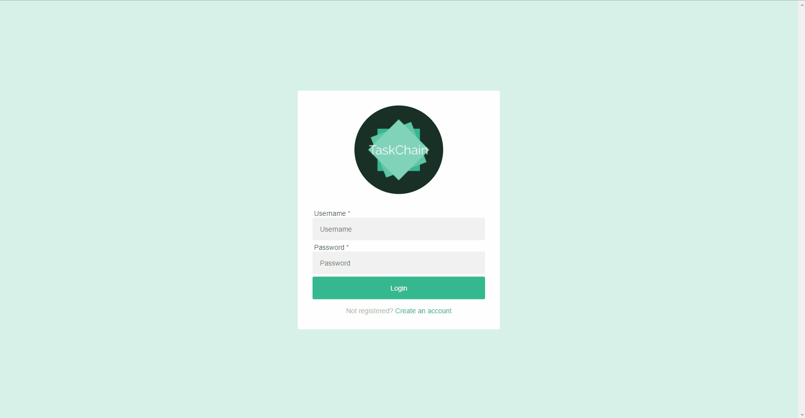

#TaskTrackChain

A task tracking app that gives context and linearity to your "To-Do" list. 

Knocking out errands and chores one task at a time helps make your day do-able. Once you've finished one task, move on to the next one. Before you realize, you're almost done with mission.

Login and add tasks to the beginning or the end of your chain. Filter your chain by, all, unfinished, or finished to see how far you have gone and how far you need to go.

<a href= "https://tasktrackerchain.herokuapp.com/">https://tasktrackerchain.herokuapp.com</a>

Mobile update coming soon. 

<h3>Contributors</h3>
<a href="https://github.com/kmbecker">Kyle Becker</a>
<a href="https://github.com/zbmiller">Zach Miller</a>
<a href="https://github.com/Cole-Mertz">Cole Mertz</a>
